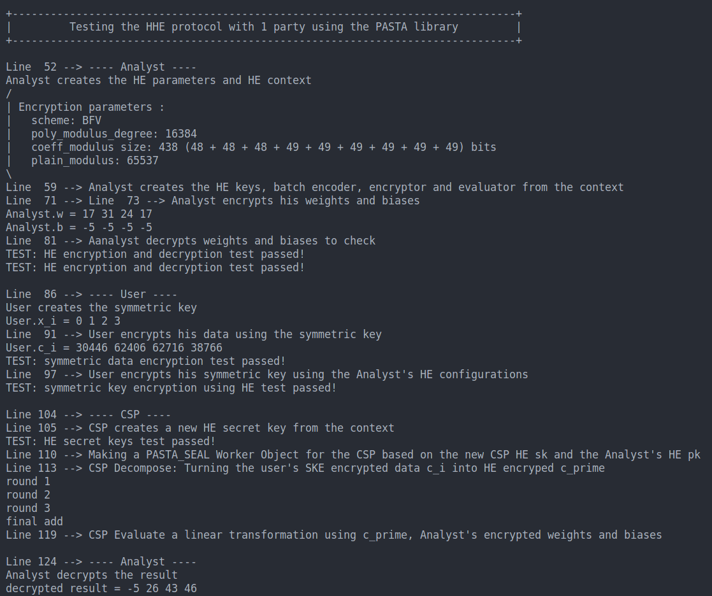

# HHE-PPML: Privacy-Preserving Machine Learning Through Hybrid Homomorphic Encryption
A Privacy-Preserving Machine Learning (PPML) protocol that is resource friendly to edge devices using Hybrid Homomorphic Encryption (HHE). It is built on top of the [SEAL](https://github.com/microsoft/SEAL) (for HE) and [PASTA](https://github.com/IAIK/hybrid-HE-framework) (for HHE) libraries.

## Requirements
`cpp==9.4.0`   
`CMAKE>=3.13`  
`SEAL==4.0.0`  

The [Microsoft SEAL library](https://github.com/microsoft/SEAL) is already installed in `libs/seal`. Also, our code are developed based on the [PASTA framework for HHE](https://github.com/IAIK/hybrid-HE-framework).

## Repository Structure
```
├── configs              
│   ├── config.cpp  # hold the configurations (HE parameters, number of runs for experiments...)
├── experiments     # hold the code for the experiments reported in the paper
├── images          # hold the images in `README.md`
├── protocols       # hold the demo code for the protocols in the paper
├── src             # hold the components needed to build the protocols 
├── tests           # hold the unit tests
└── util            # hold the utility code used in PASTA and for data communication via sockets
 ```

## Simple HHE protocol description
The protocol consists of 3 parties: a client who holds the data, the analyst who holds the neural network weights and biases, and the cloud service provider (CSP) who holds the computing power.  
1. First, the analyst creates the necessary HE parameters and keys. 
2. Then, the analyst sends the public key to the client and the evaluation key to the CSP to compute on encrypted data.
3. Next, the analyst encrypts his weights and biases using HE and send them to the CSP. The encrypted weights and biases are denoted `c_w` and `c_b` respectively.
4. The client generates a symmetric key (`K`) and encrypts his plaintext data (`x`) using a symmetric key encryption algorithm. We denote the symmetrically encrypted data `c`. He also uses the HE public key to homomorphically encrypt his symmetric key, which is `c_K`.
5. The client sends both `c` and `c_K` to the CSP.
6. After receiving the HE evaluation key `evk` from the analyst, `c` and `c_K` from the client, the CSP performs the HHE decomposition algorithm to turn `c` into `c'`, where `c'` is the HE encrypted version of `x`. The CSP then can perform HE computations on `c'`, `c_w` and `c_b` and get the result `c_res`.
7. The CSP sends `c_res` to the analyst who can decrypt it using the HE private key to get the answers on data he did not get access to.

## Running
In the terminal, `cd` into the project's directory, then run
- `cmake -S . -B build -DCMAKE_PREFIX_PATH=libs/seal`  
- `cmake --build build`  
- Then, run the produced executables in `./build`. For example running `./build/simple_hhe` will produce something similar to the figure below

